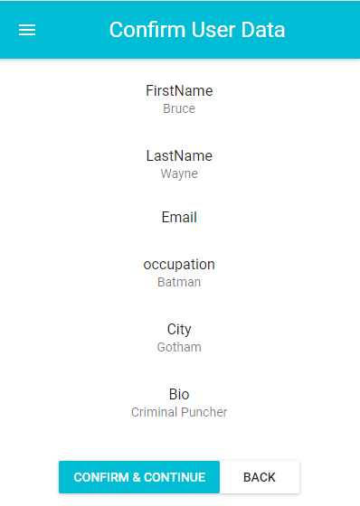

# MaterialUI_Multi_Step_Form
React multi step form with multiple components including user &amp; personal details, confirmation and success using Material-UI

This project was bootstrapped with [Create React App](https://github.com/facebook/create-react-app).

## Form Structure

### Step 1

### Step 2

### Step 3

### Success

